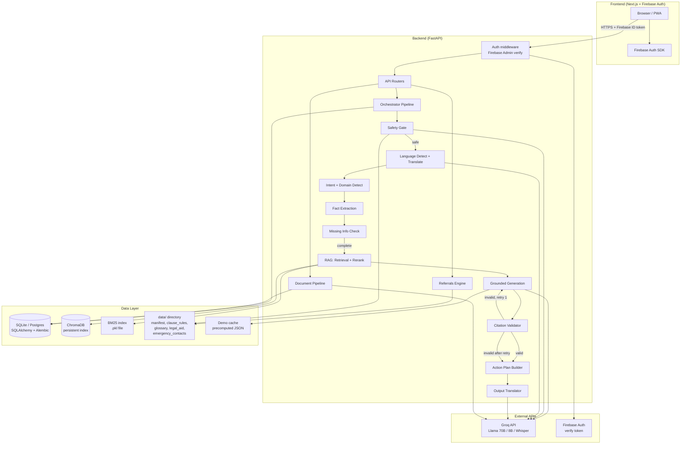
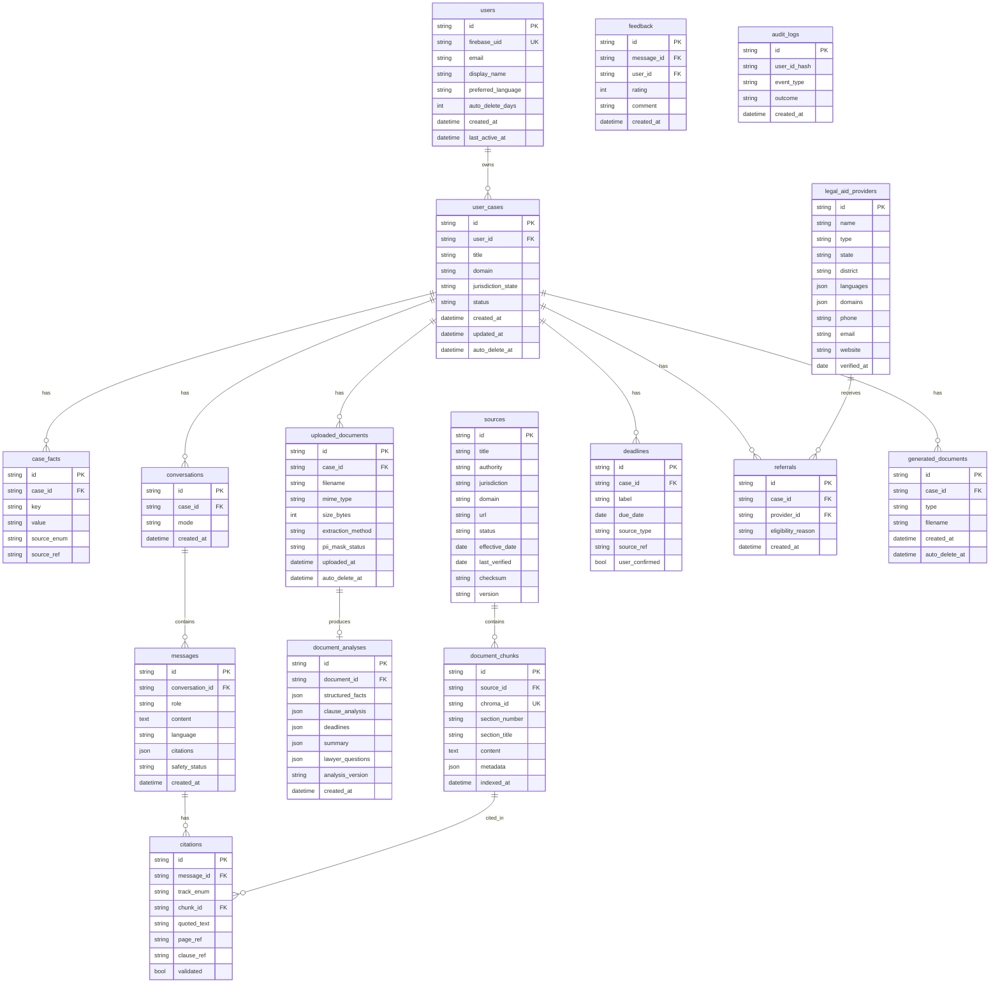

# NyayaSaathi — Design

**Version:** 1.0  
**Scope:** MVP — Residential Tenancy, Tamil Nadu + central baseline, English + Tamil  

---

## 1. Architecture Overview



---

## 2. Component Responsibilities

### 2.1 `core/`
| Module | Responsibility |
|--------|---------------|
| `config.py` | Pydantic `Settings` loaded from env vars; single import across app |
| `auth.py` | FastAPI dependency: verifies Firebase ID token, returns `user_id` |
| `logging.py` | Structured JSON logger; filters that strip document text and PII from log records |
| `security.py` | Rate-limit decorator, CORS config, request ID middleware |
| `db.py` | SQLAlchemy async engine, session factory, Alembic env |

### 2.2 `api/`
| Router | Endpoints |
|--------|-----------|
| `auth.py` | `POST /auth/verify` |
| `cases.py` | `POST /cases`, `GET /cases/{id}`, `DELETE /cases/{id}` |
| `chat.py` | `POST /chat` |
| `documents.py` | `POST /documents/upload`, `POST /documents/analyze`, `POST /documents/compare` |
| `search.py` | `GET /sources`, `POST /legal-search` |
| `actions.py` | `POST /action-plan` |
| `referrals.py` | `POST /referrals` |
| `deadlines.py` | `GET /deadlines` |
| `feedback.py` | `POST /feedback` |

All routers: inject `user_id` from `core/auth.py`, apply rate limits, use Pydantic request/response models.

### 2.3 `orchestrator/pipeline.py`
Fixed sequential pipeline — plain function calls, no agent loops:

```
safety_gate()
  → language_detect_and_translate_to_en()
  → intent_and_domain_detect()
  → fact_extraction()
  → missing_info_check()          # may return clarifying question to user
  → retrieval_and_rerank()
  → grounded_generation()         # cite-or-abstain
  → citation_validator()          # deterministic; triggers one retry
  → action_plan_builder()
  → translate_to_user_language()
```

Each step:
- Takes a `PipelineContext` dataclass (accumulated state)
- Returns an updated `PipelineContext`
- Raises `PipelineAbortError` to short-circuit (e.g. safety gate fires)
- Uses Pydantic-validated structured JSON output from LLM; one retry on validation failure

### 2.4 `rag/`
| Module | Responsibility |
|--------|---------------|
| `ingest.py` | Reads `manifest.json`, downloads/validates sources, extracts text, chunks by section heading |
| `chunker.py` | Section-aware splitter: preserves heading, section number, parent document metadata |
| `embedder.py` | BAAI/bge-m3 batch embedding with local HF cache |
| `store.py` | ChromaDB persistent client; upsert with full metadata |
| `bm25_index.py` | rank_bm25 index builder and serialiser |
| `retriever.py` | Hybrid search: BM25 score + dense cosine; fused ranking |
| `reranker.py` | bge-reranker-base cross-encoder reranking; applies similarity threshold |
| `citation_validator.py` | Deterministic: checks chunk ID in retrieved set; checks quote substring match |

### 2.5 `documents/`
| Module | Responsibility |
|--------|---------------|
| `extractor.py` | PyMuPDF → text; low-density fallback to pytesseract |
| `pii.py` | Presidio `AnalyzerEngine` + custom regex patterns (Aadhaar, PAN, phone, email) |
| `classifier.py` | LLM document-type classification with Pydantic output |
| `structured_extractor.py` | LLM structured extraction → `RentalAgreementFacts` Pydantic model |
| `clause_analyzer.py` | Rule engine over `tenancy.yaml` + LLM plain-language explanation |
| `deadline_extractor.py` | Extract dates/deadlines with page + clause source refs |
| `summarizer.py` | Plain-language summary + glossary linking + lawyer questions |
| `comparator.py` | Two-document clause alignment by embedding + clause-type labels |

### 2.6 `safety/`
| Module | Responsibility |
|--------|---------------|
| `gate.py` | Regex/keyword first-pass; LLM classifier (Llama 8B) confirmation; returns `SafetyDecision` |
| `emergency_resources.py` | Loads and caches `data/emergency_contacts.json`; never hardcoded |

### 2.7 `translation/`
| Module | Responsibility |
|--------|---------------|
| `detector.py` | Language detection (langdetect or Groq) |
| `translator.py` | Translate query to EN; translate output to target language |
| `glossary.py` | Loads `legal_terms.json`; protects terms during translation |
| `simple_language.py` | Pre-pass: replace complex legal English with plain English |

### 2.8 `referrals/`
| Module | Responsibility |
|--------|---------------|
| `finder.py` | Loads `providers.json`; applies filter criteria (state, district, language, domain) |
| `eligibility.py` | Rule-based eligibility check from provider data; no AI scoring |

---

## 3. Data Model



---

## 4. API Contracts

### 4.1 `POST /auth/verify`
Verifies the Firebase ID token and upserts the user record.

**Request:**
```json
{ "id_token": "eyJhbGc..." }
```
**Response 200:**
```json
{
  "user_id": "usr_abc123",
  "email": "user@example.com",
  "display_name": "Ravi Kumar",
  "preferred_language": "en",
  "is_anonymous": false
}
```

---

### 4.2 `POST /cases`
**Request:**
```json
{ "title": "My Rental Agreement - Chennai 2026", "domain": "tenancy" }
```
**Response 201:**
```json
{
  "case_id": "case_xyz789",
  "title": "My Rental Agreement - Chennai 2026",
  "domain": "tenancy",
  "jurisdiction_state": null,
  "created_at": "2026-09-21T10:00:00Z"
}
```

---

### 4.3 `POST /documents/upload`
Multipart form: `file` (binary) + `case_id` (string) + `consent_accepted` (bool).

**Response 201:**
```json
{
  "document_id": "doc_def456",
  "filename": "rental_agreement.pdf",
  "extraction_method": "pymupdf",
  "page_count": 8,
  "pii_entities_masked": 4,
  "ready_for_analysis": true
}
```
**Error 400:**
```json
{ "error": "unsupported_format", "detail": "Only PDF, JPEG, PNG, DOCX are accepted." }
```

---

### 4.4 `POST /documents/analyze`
**Request:**
```json
{ "document_id": "doc_def456", "case_id": "case_xyz789" }
```
**Response 200:**
```json
{
  "analysis_id": "ana_ghi012",
  "document_type": "rental_agreement",
  "structured_facts": {
    "landlord_name": "K. Subramaniam",
    "tenant_names": ["Ravi Kumar"],
    "property_address": "14, Anna Nagar, Chennai - 600040",
    "monthly_rent": 25000,
    "security_deposit": 75000,
    "lease_start": "2026-10-01",
    "lease_end": "2027-09-30",
    "lock_in_months": 6,
    "notice_period_landlord_days": 30,
    "notice_period_tenant_days": 15,
    "missing_fields": ["dispute_resolution_clause"]
  },
  "clause_analysis": [
    {
      "clause_id": "cl_001",
      "label": "Notice Period",
      "page": 3,
      "quote": "Tenant shall give 15 days notice; Landlord may terminate with 30 days notice.",
      "risk_level": "yellow",
      "reason": "The notice period is asymmetric — the tenant must give shorter notice than the landlord. This may be unusual or one-sided; consider asking a lawyer.",
      "citation": null
    }
  ],
  "deadlines": [
    {
      "label": "Lease end / renewal decision",
      "due_date": "2027-09-30",
      "source_type": "document",
      "source_ref": "Page 1, Clause 2"
    }
  ],
  "summary": "This is a 12-month residential lease for a property in Anna Nagar, Chennai...",
  "glossary_terms": ["security deposit", "lock-in period", "notice period"],
  "lawyer_questions": [
    "The notice period in this agreement is asymmetric. Is this standard for Tamil Nadu?",
    "There is no mention of stamp duty or registration. What are the implications?"
  ],
  "limitation_text": "NyayaSaathi provides legal information to help you understand and prepare. It is not legal advice and does not replace a qualified lawyer."
}
```

---

### 4.5 `POST /chat`
**Request:**
```json
{
  "case_id": "case_xyz789",
  "message": "Can my landlord enter the property without notice?",
  "language": "en",
  "mode": "document_qa"
}
```
**Response 200:**
```json
{
  "message_id": "msg_jkl345",
  "answer": "Your agreement does not contain a clause restricting landlord entry without notice. The absence of such a clause may be unusual or one-sided; consider asking a lawyer.",
  "language": "en",
  "evidence": [
    {
      "track": "user_document",
      "quote": "Landlord reserves the right to inspect the premises at any time.",
      "page": 4,
      "clause": "Clause 9 — Landlord Access"
    }
  ],
  "citations_validated": true,
  "safety_status": "safe",
  "machine_translated": false,
  "english_original": null,
  "limitation_text": "NyayaSaathi provides legal information..."
}
```

---

### 4.6 `POST /legal-search`
**Request:**
```json
{
  "query": "What is the maximum security deposit allowed in Tamil Nadu?",
  "jurisdiction": "TN",
  "language": "en"
}
```
**Response 200:**
```json
{
  "answer": "I couldn't verify this information from an authoritative source. Please check the relevant government/legal source or consult a qualified lawyer.",
  "citations": [],
  "abstained": true,
  "limitation_text": "NyayaSaathi provides legal information..."
}
```
*(Abstention example — source not yet in corpus)*

---

### 4.7 `POST /action-plan`
**Request:**
```json
{ "case_id": "case_xyz789", "analysis_id": "ana_ghi012" }
```
**Response 200:**
```json
{
  "plan_id": "plan_mno678",
  "sections": {
    "what_i_understood": "You have a 12-month residential lease in Chennai...",
    "possible_legal_area": "Residential tenancy — Tamil Nadu Regulation of Rights and Responsibilities of Landlords and Tenants Act (TODO_VERIFY effective date)",
    "what_you_can_do_next": [
      "Review the asymmetric notice period clause with a lawyer before signing.",
      "Confirm whether the agreement requires registration and stamp duty payment."
    ],
    "documents_you_may_need": ["Signed copy of the agreement", "Rent receipts", "Identity proof"],
    "important_dates": [
      { "label": "Lease end", "date": "2027-09-30", "source": "Page 1, Clause 2" }
    ],
    "official_resources": [],
    "when_to_seek_a_lawyer": "If you are unsure about any clause, if the landlord refuses to register the agreement, or before signing.",
    "important_limitation": "NyayaSaathi provides legal information to help you understand and prepare. It is not legal advice and does not replace a qualified lawyer."
  }
}
```

---

### 4.8 Error Envelope (all endpoints)
```json
{
  "error": "rate_limit_exceeded",
  "detail": "You have exceeded 30 requests per minute. Please wait and try again.",
  "retry_after_seconds": 45
}
```

| HTTP Code | Meaning |
|-----------|---------|
| 400 | Validation error / bad input |
| 401 | Missing or invalid Firebase token |
| 403 | Token valid but resource belongs to different user |
| 413 | File too large |
| 422 | Pydantic schema validation failure |
| 429 | Rate limit exceeded |
| 500 | Internal error (sanitised message, full detail in server logs only) |

---

## 5. Orchestrator Pipeline — Detailed Design

### 5.1 `PipelineContext` (Pydantic dataclass)
```python
class PipelineContext(BaseModel):
    # Input
    user_id: str
    case_id: str
    raw_query: str
    language: str                    # detected or user-chosen
    mode: Literal["chat", "document_qa", "legal_search"]

    # Safety
    safety_status: Literal["safe", "high_risk", "unknown"] = "unknown"
    emergency_resources: list[EmergencyContact] = []

    # Language
    query_en: str | None = None      # English-translated query
    detected_language: str | None = None

    # Intent
    intent: str | None = None
    domain: str | None = None
    jurisdiction: str | None = None

    # Facts
    extracted_facts: dict = {}
    missing_required_facts: list[str] = []
    clarifying_question: str | None = None   # set → return to user, stop pipeline

    # Retrieval
    retrieved_chunks: list[RetrievedChunk] = []
    reranked_chunks: list[RetrievedChunk] = []

    # Generation
    raw_answer: str | None = None
    citations: list[CitationAttempt] = []
    citations_validated: bool = False
    generation_attempts: int = 0

    # Action Plan
    action_plan: ActionPlan | None = None

    # Output
    final_answer: str | None = None
    final_language: str | None = None
    machine_translated: bool = False
    english_original: str | None = None
    abstained: bool = False
```

### 5.2 LLM Call Pattern (all steps)
```python
for attempt in range(2):
    raw = groq_client.chat(messages=..., response_format={"type": "json_object"})
    try:
        result = TargetModel.model_validate_json(raw)
        break
    except ValidationError:
        if attempt == 1:
            raise PipelineStepError("LLM output failed validation after 2 attempts")
```

### 5.3 Demo Cache Layer
```python
# In retrieval_and_rerank() and grounded_generation()
if settings.DEMO_CACHE_ENABLED:
    cache_key = sha256(query_en + case_id).hexdigest()
    cached = load_demo_cache(cache_key)
    if cached:
        return cached
```

---

## 6. RAG Design

### 6.1 Chunk Schema
```json
{
  "chunk_id": "tn_tenancy_act_2017_s12_c001",
  "source_id": "tn_tenancy_act_2017",
  "section_number": "12",
  "section_title": "Security Deposit",
  "text": "...",
  "metadata": {
    "source": "Tamil Nadu Regulation of Rights and Responsibilities of Landlords and Tenants Act",
    "authority": "Government of Tamil Nadu",
    "jurisdiction": "TN",
    "domain": "tenancy",
    "effective_date": "TODO_VERIFY",
    "last_verified": "TODO_VERIFY",
    "status": "active",
    "version": "1.0",
    "checksum": "sha256:..."
  }
}
```

### 6.2 Hybrid Retrieval Fusion
```
bm25_scores  = bm25_index.get_scores(tokenised_query)   # top-K
dense_scores = chroma.query(query_embedding, n_results=K)
fused        = reciprocal_rank_fusion(bm25_scores, dense_scores)
reranked     = bge_reranker.rerank(query, fused[:20])
final        = [c for c in reranked if c.score >= SIMILARITY_THRESHOLD]
```

### 6.3 Citation Validator (deterministic)
```python
def validate_citation(citation: CitationAttempt, retrieved_chunks: list[RetrievedChunk]) -> bool:
    # Rule 1: chunk ID must be in retrieved set
    chunk_ids = {c.chunk_id for c in retrieved_chunks}
    if citation.chunk_id not in chunk_ids:
        return False
    # Rule 2: quoted text must appear verbatim in chunk content
    chunk = next(c for c in retrieved_chunks if c.chunk_id == citation.chunk_id)
    return citation.quoted_text.strip() in chunk.content
```

---

## 7. Prompt Strategy

### 7.1 Principles
- All prompts are stored as Jinja2 templates in `app/orchestrator/prompts/`
- No legal facts, section numbers, or thresholds are hardcoded in prompts
- Every generation prompt ends with: *"If you cannot answer from the provided context, respond with the JSON field `abstain: true` and leave `answer` empty."*
- System prompts are versioned (included in audit log)

### 7.2 Grounded Generation Prompt (template sketch)
```
You are NyayaSaathi, a legal information assistant. You help users understand documents and Indian law.
You must ONLY use the context provided below. Do NOT use your training knowledge for legal facts.

RETRIEVED CONTEXT:

[SOURCE {{ loop.index }}] {{ chunk.section_title }} ({{ chunk.metadata.source }}, {{ chunk.metadata.jurisdiction }})
{{ chunk.content }}


USER QUESTION: {{ query_en }}

Respond in JSON:
{
  "answer": "<answer text using ONLY the above context, or empty string if abstaining>",
  "abstain": <true|false>,
  "citations": [
    { "chunk_id": "<id>", "quoted_text": "<verbatim quote from above context>", "claim": "<sentence in answer this supports>" }
  ]
}

If you cannot answer from the provided context, set abstain=true and answer="".
Never invent legal facts, section numbers, deposit limits, or deadlines.
```

### 7.3 Safety Gate Prompt (Llama 8B classifier)
```
Classify the following user message for risk level.
Return JSON: { "risk_level": "high_risk" | "safe", "categories": ["arrest"|"domestic_violence"|"child_safety"|"eviction_immediate"|"self_harm"|"criminal"|"court_imminent"] }

Message: {{ user_message }}
```

### 7.4 Clause Explanation Prompt
```
Explain the following rental agreement clause in plain language suitable for a first-time renter.
Risk level determined by rule engine: {{ risk_level }}

Clause text: {{ clause_text }}
Rule reason: {{ rule_reason }}

Rules:
- Use the phrase "may be unusual or one-sided; consider asking a lawyer" for yellow/red clauses
- NEVER use the words "illegal" or "void" unless a cited source in the context below supports it
- Keep explanation under 80 words
- Output JSON: { "explanation": "...", "uses_source": false }


Supporting sources: {{ supporting_sources }}

```

---

## 8. Hallucination Prevention Layers

| Layer | Mechanism | Where |
|-------|-----------|-------|
| 1. No training-data legal facts | System prompt forbids using training knowledge for legal claims | Every generation prompt |
| 2. Context-only generation | Retrieved chunks explicitly provided; no retrieval = abstain | `grounded_generation()` |
| 3. Similarity threshold | Chunks below threshold discarded before generation | `reranker.py` |
| 4. Deterministic citation validator | Code (not LLM) verifies chunk ID + verbatim quote | `citation_validator.py` |
| 5. One regeneration | On validator failure: regenerate once, then abstain | `pipeline.py` |
| 6. Abstention standard message | Standard message replaces any unverifiable claim | `pipeline.py` |
| 7. Wording rules | "may be unusual/one-sided" enforced in prompt; "illegal/void" blocked without source | `clause_explanation` prompt |
| 8. No invented deadlines | Deadlines extracted from document text only, with page citation | `deadline_extractor.py` |
| 9. Jurisdiction gate | Mismatched-jurisdiction chunks excluded; user asked for state | `retriever.py`, `pipeline.py` |
| 10. TODO_VERIFY markers | Data files use `TODO_VERIFY` for unverified legal facts | `manifest.json`, `tenancy.yaml` |

---

## 9. Privacy Design

### 9.1 Data Flow
```
User uploads document
  → size/type validation (no content read until consent)
  → consent accepted → extraction
  → PII mask (Presidio + regex)
  → masked text stored in DB (not original file)
  → masked text → all LLM calls
  → original file discarded immediately after extraction
```

### 9.2 Logging Rules (enforced by log filter in `core/logging.py`)
- Filter strips any field containing `document_text`, `extracted_text`, `masked_text`, `clause_text`
- Audit log records only: `user_id_hash`, `event_type`, `outcome`, `timestamp`
- No PII in any log level including DEBUG

### 9.3 Retention
- `auto_delete_days` stored per user (default 30, configurable)
- Background job (APScheduler or Celery beat) checks daily and deletes expired cases
- Deletion logs the event in audit log — no content
- "Delete all" endpoint: immediate synchronous delete + audit log entry

### 9.4 Consent Log Schema
```json
{ "user_id": "...", "timestamp": "...", "consent_version": "1.0", "language": "en", "action": "accepted" }
```

---

## 10. Frontend Architecture

### 10.1 Screen Map
```
/                     → Landing (language picker first)
/login                → Login (Google sign-in + anonymous try)
/app/assistant        → Main chat (+ mic + citation cards + source badges)
/app/cases            → Case Dashboard
/app/cases/new        → New Case wizard
/app/cases/[id]       → Case detail / conversation
/app/upload           → Document Upload (consent → upload → progress)
/app/analysis/[id]    → Document Analysis (split view: doc + clause panel)
/app/compare          → Compare Two Documents
/app/action-plan/[id] → Action Plan (printable)
/app/deadlines        → Deadline list
/app/legal-help       → Legal-Aid Finder + eligibility quiz
/app/resources        → Official Resources
/app/privacy          → Privacy Settings
/emergency            → Emergency Card (accessible from any screen, quick-exit)
```

### 10.2 Key Component Patterns
- **Citation card:** `<CitationCard track="document|official|unverified" quote="..." source="..." page="..." />`
- **Traffic light clause:** `<ClauseRisk level="green|yellow|red" icon label reason />` — always icon + label, never colour alone
- **Source badge:** `<SourceBadge type="document|official|unverified" />` inline in answers
- **Language toggle:** persistent in header; switching language re-fetches translated version if available
- **Emergency button:** fixed position, always visible, links to `/emergency`

### 10.3 State Management
- Server state: React Query (`@tanstack/react-query`) for all API calls
- Auth state: Firebase Auth context provider
- UI state: Zustand (language preference, current case, sidebar open)

### 10.4 Accessibility
- All tap targets ≥ 48 × 48 px
- Colour never the sole indicator (always paired with icon + text)
- `aria-label` on all icon-only buttons
- Focus management on modals and route transitions
- SpeechSynthesis read-aloud on all answer blocks

---

## 11. Error Handling Strategy

| Failure | Handling |
|---------|---------|
| Firebase token invalid | 401; client redirects to login |
| File wrong format | 400 with allowed formats list |
| File too large | 413 before file content is read |
| Extraction failure | Partial result flagged; user informed |
| PII mask failure | Block entire pipeline; return safe error; log event |
| LLM validation failure (attempt 1) | Retry with same prompt |
| LLM validation failure (attempt 2) | Return partial result or abstention |
| Citation validation failure (attempt 1) | Regenerate answer |
| Citation validation failure (attempt 2) | Abstain with standard message |
| Groq 429 rate limit | Exponential backoff (1s, 2s, 4s); serve demo cache if enabled |
| Groq 5xx | Retry once; then return 503 with retry hint |
| ChromaDB unavailable | Return 503; do not fall back to uncited LLM answers |
| Safety gate uncertain | Default to high-risk (fail-safe) |
| Missing jurisdiction | Ask user before proceeding; never guess |

---

## 12. Test Strategy

### 12.1 Unit Tests (pytest)
| Test Suite | What It Tests |
|-----------|--------------|
| `tests/test_citation_validator.py` | Valid citation passes; chunk ID not in set fails; quote not verbatim fails; partial quote fails |
| `tests/test_safety_gate.py` | High-risk keywords trigger high-risk; safe inputs pass; edge cases (mixed) |
| `tests/test_clause_rules.py` | Each rule in `tenancy.yaml` fires on matching clause text; no false positives on standard clauses |
| `tests/test_deadline_extractor.py` | Dates extracted with correct page + clause ref; invented dates fail |
| `tests/test_abstention.py` | Unanswerable questions return standard abstention message; no invented answer |
| `tests/test_pii_masking.py` | Aadhaar, PAN, phone, email masked; masked text contains no originals |
| `tests/test_pipeline.py` | High-risk input never reaches generation step; pipeline short-circuits correctly |

### 12.2 Integration Tests
- Full pipeline on a synthetic rental agreement (no real PII)
- `POST /documents/upload` → `POST /documents/analyze` → `POST /chat` happy path
- `POST /chat` with high-risk input: assert response contains emergency resources only

### 12.3 Evaluation Harness (`eval/`)
| Metric | Method |
|--------|--------|
| Citation validity rate | Run 50 Q&A pairs; count citations that pass validator |
| Correct abstention rate | 20 unanswerable questions; count standard abstention responses |
| Clause detection recall | 5-10 test agreements with known clauses; count detected / total |
| Deadline extraction accuracy | Test agreements with known dates; compare extracted vs ground truth |
| Unsafe output rate | 30 high-risk prompts; assert 0 contain strategy/prediction content |

---

## 13. Deployment Architecture

```
Frontend (Vercel)
  → Next.js static + SSR
  → Firebase Auth SDK
  → env: NEXT_PUBLIC_* vars

Backend (Render / Railway)
  → Docker container: Python 3.11 + FastAPI + uvicorn
  → Persistent disk: ChromaDB index + BM25 index + HF model cache
  → Secrets: env vars injected at deploy time (never in image)
  → DB: SQLite on persistent disk (dev) / Postgres (prod)
  → Health check: GET /health → 200

Pre-deploy scripts (run once):
  python scripts/ingest_sources.py   # build ChroamDB + BM25 index
  alembic upgrade head               # run DB migrations
```

---

## 14. Data File Schemas

### 14.1 `data/sources/manifest.json`
```json
[
  {
    "id": "tn_tenancy_act_2017",
    "title": "Tamil Nadu Regulation of Rights and Responsibilities of Landlords and Tenants Act",
    "authority": "Government of Tamil Nadu",
    "jurisdiction": "TN",
    "domain": "tenancy",
    "url": "TODO_VERIFY",
    "status": "active",
    "effective_date": "TODO_VERIFY",
    "last_verified": "TODO_VERIFY",
    "filename": "tn_tenancy_act_2017.pdf"
  },
  {
    "id": "model_tenancy_act_2021",
    "title": "Model Tenancy Act 2021",
    "authority": "Ministry of Housing and Urban Affairs, Government of India",
    "jurisdiction": "central",
    "domain": "tenancy",
    "url": "TODO_VERIFY",
    "status": "active",
    "effective_date": "TODO_VERIFY",
    "last_verified": "TODO_VERIFY",
    "filename": "model_tenancy_act_2021.pdf"
  }
]
```

### 14.2 `data/clause_rules/tenancy.yaml` (structure)
```yaml
version: "1.0"
domain: tenancy
rules:
  - id: asymmetric_notice_period
    label: "Asymmetric Notice Period"
    description: "Tenant notice period shorter than landlord notice period"
    risk_level: yellow
    detection:
      type: structured_field_comparison
      fields: [notice_period_tenant_days, notice_period_landlord_days]
      condition: "tenant < landlord"
    explanation_hint: "The notice period is different for tenant and landlord. This may be unusual or one-sided; consider asking a lawyer."
    source: null   # TODO_VERIFY with official source

  - id: no_deposit_refund_timeline
    label: "No Deposit Refund Timeline"
    description: "Agreement does not specify when security deposit will be returned"
    risk_level: yellow
    detection:
      type: missing_field
      fields: [deposit_refund_days]
    explanation_hint: "There is no mention of when your security deposit will be returned. This may be unusual or one-sided; consider asking a lawyer."
    source: null   # TODO_VERIFY

  - id: landlord_entry_without_notice
    label: "Landlord Entry Without Notice"
    description: "Landlord can enter without giving notice"
    risk_level: red
    detection:
      type: keyword_in_clause
      keywords: ["at any time", "without notice", "without prior notice"]
      clause_types: [landlord_access, inspection]
    explanation_hint: "This clause allows the landlord to enter the property without giving you advance notice. This may be unusual or one-sided; consider asking a lawyer."
    source: null   # TODO_VERIFY

  - id: unilateral_rent_hike
    label: "Unilateral Rent Increase"
    description: "Landlord can increase rent without tenant consent"
    risk_level: red
    detection:
      type: keyword_in_clause
      keywords: ["at the discretion of", "may increase", "sole discretion"]
      clause_types: [rent, payment]
    explanation_hint: "This clause may allow the landlord to increase rent without your agreement. This may be unusual or one-sided; consider asking a lawyer."
    source: null   # TODO_VERIFY

  - id: missing_registration_mention
    label: "No Registration / Stamp Duty Mention"
    description: "Agreement does not mention stamp duty or registration"
    risk_level: yellow
    detection:
      type: missing_keyword
      keywords: ["stamp duty", "registration", "registered"]
    explanation_hint: "The agreement does not mention stamp duty or registration. This may be unusual or one-sided; consider asking a lawyer."
    source: null   # TODO_VERIFY

  - id: missing_dispute_resolution
    label: "No Dispute Resolution Clause"
    description: "Agreement does not specify how disputes will be resolved"
    risk_level: yellow
    detection:
      type: missing_field
      fields: [dispute_resolution_clause]
    explanation_hint: "There is no clause explaining how disputes between landlord and tenant will be resolved. This may be unusual or one-sided; consider asking a lawyer."
    source: null   # TODO_VERIFY
```

### 14.3 `data/emergency_contacts.json` (structure)
```json
{
  "verified_at": "TODO_VERIFY",
  "contacts": [
    {
      "id": "nalsa_helpline",
      "name": "NALSA Legal Services Helpline",
      "number": "TODO_VERIFY",
      "type": "legal_aid",
      "scope": "national",
      "languages": ["en", "hi"],
      "description": "Free legal aid and advice"
    },
    {
      "id": "tn_dlsa",
      "name": "Tamil Nadu District Legal Services Authority",
      "number": "TODO_VERIFY",
      "type": "legal_aid",
      "scope": "TN",
      "languages": ["en", "ta"],
      "description": "Free legal services for eligible persons in Tamil Nadu"
    },
    {
      "id": "women_helpline",
      "name": "Women Helpline",
      "number": "TODO_VERIFY",
      "type": "emergency",
      "scope": "national",
      "languages": ["en", "hi", "ta"],
      "description": "For women in distress including domestic violence"
    },
    {
      "id": "police",
      "name": "Police Emergency",
      "number": "100",
      "type": "emergency",
      "scope": "national",
      "languages": ["en", "hi", "ta"],
      "description": "Police emergency"
    },
    {
      "id": "child_helpline",
      "name": "Child Helpline",
      "number": "TODO_VERIFY",
      "type": "emergency",
      "scope": "national",
      "languages": ["en", "hi", "ta"],
      "description": "For children in distress"
    }
  ]
}
```

### 14.4 `data/glossary/legal_terms.json` (structure)
```json
{
  "version": "1.0",
  "terms": [
    {
      "id": "security_deposit",
      "en": "Security Deposit",
      "ta": "பாதுகாப்பு வைப்பு",
      "hi": "सुरक्षा जमा",
      "definition_en": "A sum of money paid by the tenant to the landlord before moving in, returned at the end of the tenancy subject to deductions for damages.",
      "protected": false
    },
    {
      "id": "lock_in_period",
      "en": "Lock-in Period",
      "ta": "லாக்-இன் காலம்",
      "hi": "लॉक-इन अवधि",
      "definition_en": "A minimum period during which neither party can terminate the agreement without paying a penalty.",
      "protected": false
    },
    {
      "id": "notice_period",
      "en": "Notice Period",
      "ta": "அறிவிப்பு காலம்",
      "hi": "नोटिस अवधि",
      "definition_en": "The amount of advance notice required before ending the tenancy.",
      "protected": false
    }
  ]
}
```
